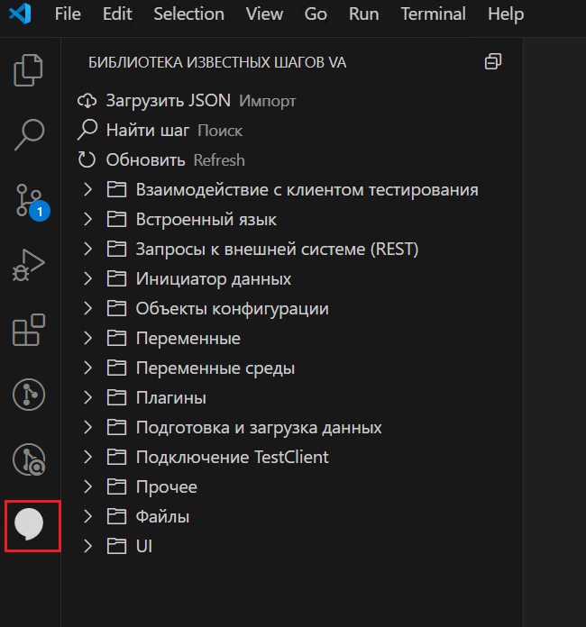
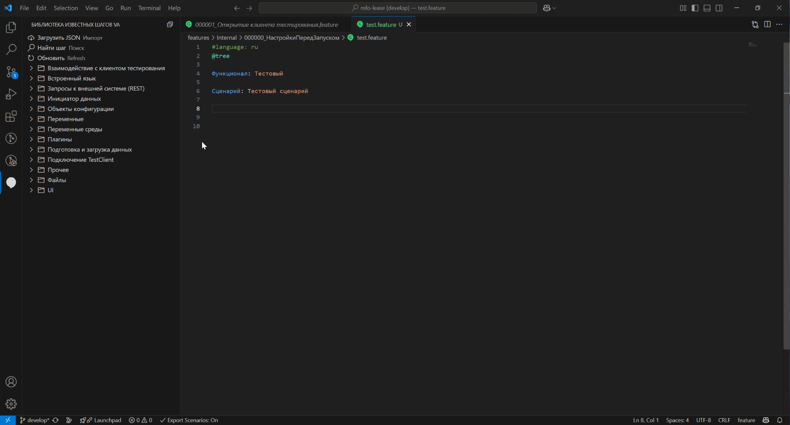
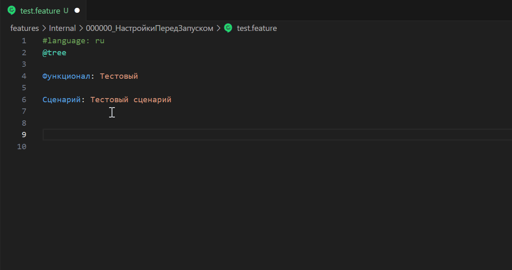
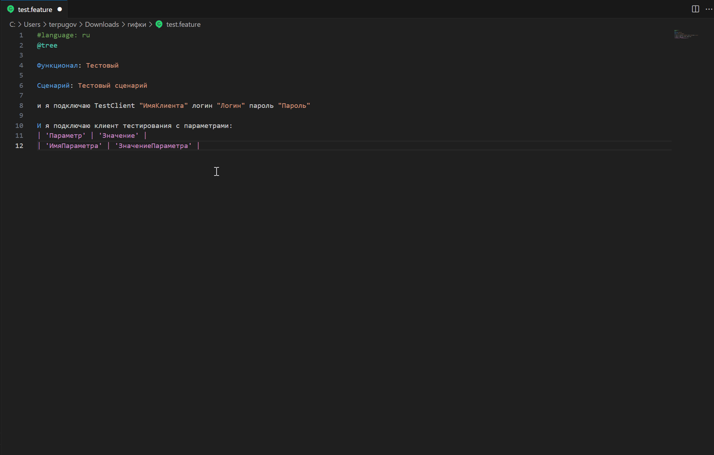
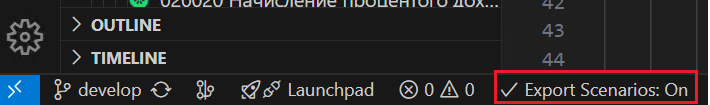
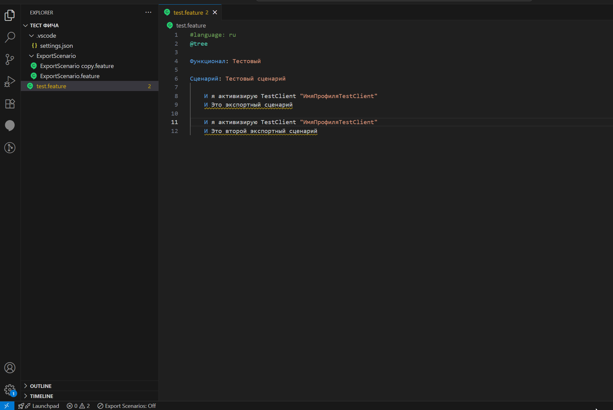

# Cucumber (Gherkin) Full Support — VA Edition

Расширение VS Code для работы с `.feature` файлами в проектах на базе **Vanessa Automation**.  
Обеспечивает подсветку синтаксиса, автодополнение шагов из `.bsl` библиотек и JSON-каталогов, визуальный редактор таблиц Gherkin и встроенную библиотеку шагов прямо в боковой панели VS Code.

---
## Возможности

### Подсветка синтаксиса
- Полная раскраска `.feature` файлов: ключевые слова (`Функционал`, `Сценарий`, `Когда`, `Тогда` и др.)
- Подсветка строк в одинарных и двойных кавычках
- Выделение переменных шаблонов `<ПеременнаяСценария>`
- Раскраска тегов `@ТегСценария`
- Подсветка комментариев и строк-таблиц `| ... |`
- Поддержка русского и многих других языков Gherkin
---

### Библиотека шагов VA (боковая панель)
Просмотр известных шагов Vanessa Automation прямо внутри VS Code без переключения в менеджер тестирования.

  

**Как использовать:**

Стартово уже есть все известные шаги включая расширение [RAT](https://github.com/bia-technologies/rat). Но всегда можно дополнить в случае выхода новых версий + свои собственные шаги.

1. Экспортируйте шаги из Vanessa automation в JSON прямо из библиотеки шагов
2. В VS Code выполните команду `VA Библиотека: Загрузить JSON`
3. Откройте панель **Библиотека известных шагов VA** на боковой панели активности

**Возможности панели:**
- Дерево шагов по папкам/группам
- Поиск шага: `VA Библиотека: Найти шаг`
- Клик по шагу — вставка в текущий `.feature` файл на позицию курсора
- Открытие описания шага через контекстное меню
- Обновление библиотеки: `VA Библиотека: Обновить`
- Открытие исходного JSON: `VA Библиотека: Открыть JSON`

  

---

### Контекстный помощник подбора шагов
- Подсказки шагов по мере набора текста в `.feature` файле
- Источники шагов:
  - `.bsl` файлы библиотек Vanessa Automation (читает комментарии-описания шагов)
  - `.feature` файлы с тегом `@ExportScenarios` (сценарии как вызываемые шаги)
- Сортировка подсказок по частоте использования
- Умные сниппеты: параметры шага автоматически становятся полями для заполнения
- Строгий режим: показывать только шаги, объявленные через соответствующее ключевое слово (`Когда`, `Тогда` и т.д.)

  

---

### Визуальный редактор таблиц Gherkin
Редактирование таблиц данных в `.feature` файлах через удобный интерфейс — без ручного выравнивания и подсчёта пробелов.

**Как открыть:**
- Поставьте курсор на любую строку таблицы (`| ... |`)
- Правая кнопка мыши → `Gherkin: Редактировать таблицу`
- Или горячая клавиша `Ctrl+Shift+T`

**Возможности редактора:**
- Редактирование всех ячеек в виде таблицы с инпутами
- Добавление строк (`+ Строка`) и колонок (`+ Колонка`)
- Удаление строк и колонок (кнопка `✕`)
- Перемещение строк вверх/вниз (`↑` / `↓`)
- Перемещение колонок влево/вправо (`←` / `→`)
- Скрытие/показ колонок (чекбоксы) — скрытые колонки не попадают в файл при сохранении
- Автоматическое обёртывание значений ячеек в одинарные кавычки `'...'` при сохранении
- Проверка существующих кавычек — двойного оборачивания не происходит
- Автоматическое выравнивание отступа таблицы относительно шага, под которым она написана

### Выравнивание таблицы без открытия редактора
- Правая кнопка мыши → `Gherkin: Выровнять таблицу под курсором`
- Или горячая клавиша `Ctrl+Alt+T`

Выровнивает ширину всех колонок по самому длинному значению прямо в файле.

  

---
### Экспортируемые сценарии (`@ExportScenarios`)

### Переключатель Export Scenarios

Переключить: кнопка в строке состояния `Export Scenarios: On/Off` или команда `Cucumber: Toggle Export Scenarios`.

  

Сценарии с тегом `@ExportScenarios` из `.feature` файлов рабочего пространства становятся доступны как подсказки-шаги в других `.feature` файлах.

  

---

## Горячие клавиши

| Действие | Клавиша |
|---|---|
| Открыть редактор таблицы | `Ctrl+Shift+T` |
| Выровнять таблицу под курсором | `Ctrl+Alt+T` |

---

## Основа

Расширение создано на базе [VSCucumberAutoComplete](https://github.com/alexkrechik/VSCucumberAutoComplete) от Alexander Krechik и доработано для использования совместно с [Vanessa Automation](https://github.com/Pr-Mex/vanessa-automation) — фреймворком BDD-тестирования для платформы 1С:Предприятие.

**Добавленные возможности по сравнению с оригиналом:**
- Поддержка `.bsl` файлов библиотек Vanessa Automation как источников шагов
- JSON-каталог шагов VA с боковой панелью просмотра прямо в VS Code
- Визуальный редактор таблиц Gherkin с выравниванием и управлением колонками
- Поддержка сценариев `@ExportScenarios` как вызываемых шагов
- Адаптация форматирования и поведения под русскоязычные проекты на Vanessa Automation